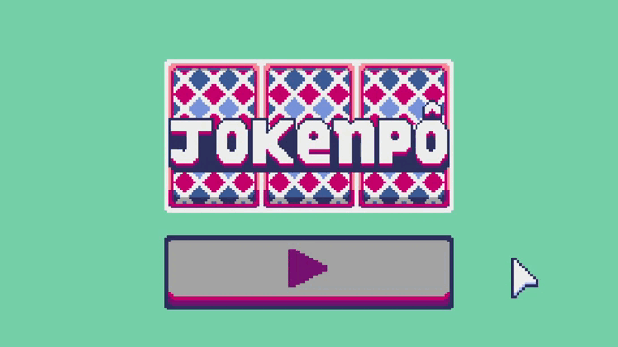

<header>

</header>

  <h3>Sobre o projeto</h3>
  <h4>🚧⚠️Em desenvolvimento...⚠️🚧</h4>

Jokenpô - jogo de cartas - feito em python com Pygame.

  <h3>Resultado</h3>
  <figure>
   
  </figure>

